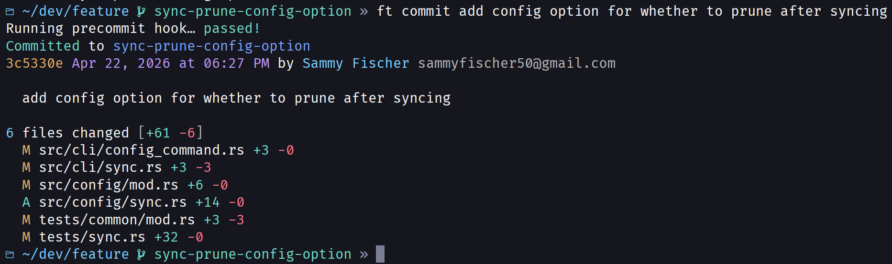
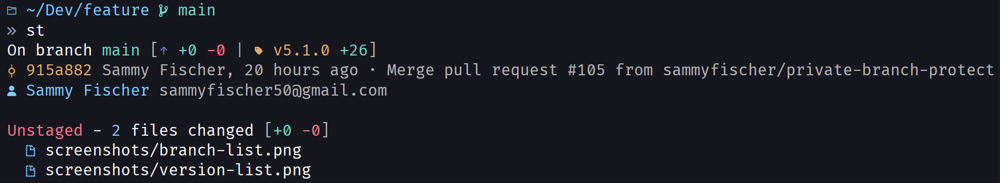
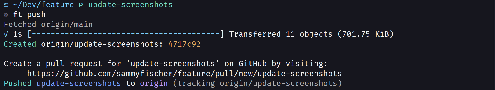

# Feature

A cli that enhances git.

## Install

### Stable / Supported Platforms

1. Download the artifact for your platform from the releases page.
2. Extract the binary and place it somewhere it can be found in your PATH.
3. To get shell completions, run `feature completions <shell>`. More instructions can be found [in the docs](./docs/completions.md).

### Development / Unsupported Platforms

Clone the repo and run `cargo install --path .` from the projects root. If you have just, run `just install`.

## Contributing

Read the files in `./contributing` to understand procedures and conventions used for this project.

## Docs

- [List of commands](./docs/commands.md)
- [Config files](./docs/config.md)
- [Completions](./docs/completions.md)
- [What are feature projects?](./docs/projects.md)

## What is feature?

Feature's main purposes are:

- to simplify existing git commands
- to automate more complex tasks, like pruning merged branches
- to prettify and simplify command outputs

Feature uses the concept of a base branch in a lot of places. A base branch is the branch which a feature branch started from, and is intended to be merged back into when complete.

Feature uses these base branches automatically in places where it makes sense. For example, `feature update` rebases the current branch onto its base, no arguments needed. `feature prune` checks branches against their base to see if they can be safely deleted.

While feature's functionality is generally meant to work with the concept of feature and base branches, there are some commands that are useful in general:

- `sync` - probably feature's most useful command. It's a general purpose command to sync the entire repo. This updates all branches to their upstreams, deletes unneeded branches, updates git submodules, and syncs each feature project.
- `start` and `commit` take all trailing command line args and put them together to form a branch name or commit message, respectively.
- `commit`, `status`, and `list` print a customized outupt that is much more detailed, compact, and colorful than git's default output

## Highlights

> I'm using a bash alias to use `ft` instead of `feature`

Commit

Status

First push without any cli options

## Feature workflow

Here's a summary of the feature workflow:

1. Switch to a base branch.
2. Start a feature branch with `feature start …`.
   - tip: instead of switching to the branch first, you can use `feature start --from <base> …`
3. Begin implementing the feature.
4. If it's a new day, check `feature st` to remember where you were and what changes you have.
5. Finish and commit with `feature commit …`.
6. If some time has passed, or you know that there are new changes on the base branch, run `feature update`.
7. Push changes to remote with `feature push`.
8. Use your repository hosting service (GitHub, Gitlab, etc.) to bring the changes into the base branch.
9. Clean up feature branch and switch back to base with `feature end`.
10. Update and clean up all branches with `feature sync`.
