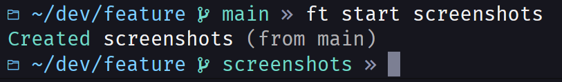
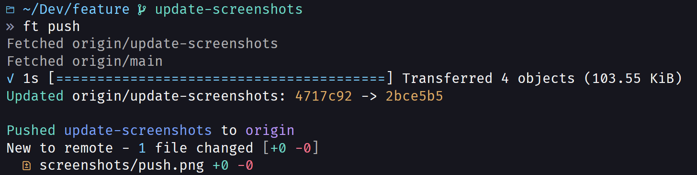
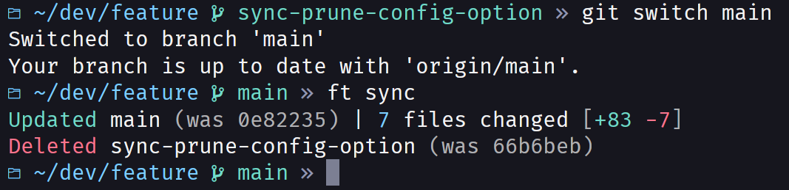

# Commands

## General info

You can run `feature <command> --help` to get info about a particular command, or `feature --help` to get list the available commands.

Many commands support support a `--dry-run` option, which doesn't modify the repo but displays command output as if the command were run. Use `--help` to check. Dry-run mode may still fetch remote-tracking branches.

## Start

```bash
feature start my new branch
feature start --from dev my new branch
feature start --stay create but dont switch
```

Starts a new feature branch. Must be called from a known base branch.

This is similar to calling `git switch -c`, except that:

- feature will automatically detect the starting branch as its base
- feature will take all trailing command line args and string them together as the branch name
- you can specify a custom template for all branch names to follow
  - view `feature start --help` for detailed info

Using the `--stay` option is similar to calling `git branch …`.



## Commit

```bash
feature commit implement some changes
feature commit --amend
feature commit --to feature1 separate concerns
```

Commits staged changes to the current branch.

With `--to`, attempts to apply staged changes to that branch instead. This safely checks if the changes would result in conflicts, and aborts if so.
Works best when the changes in each branch are unrelated (in separate files, or far enough apart if they're in the same file).

With `--amend`, amends the most recent commit by adding the staged changes, and optionally replaces the commit message.

These are similar to `git commit` except that:

- command line args are concatenated as the commit message
- running with `--amend` doesn't require a commit message, and will instead reuse the existing message
- you can commit anywhere using `--to`
- it displays a summary of files changed by the commit, and the authorship info used for the commit
  - for an amend, it displays only the amended changes, not the total changes from its parent commit
  - for a merge commit, it displays all the changes brought into the target branch by the merge (i.e. diff against its first parent)


## Base

```bash
feature base main
feature base main --branch feature-branch
```

Sets the base branch of `branch`. If no `branch` is specified, uses the current branch.

The base branch is metadata used solely by feature. It only accepts short local branch names, e.g. `main`. It doesn't accept `origin/main` or `refs/heads/main`, for example. It will automatically determine if the branch has an upstream, and use that if available.

## Update

```bash
feature update
feature update main
```

Updates the current branch with its base.

This is similar to `git rebase` except that:

- it automatically detects the base branch when possible

## Push

```bash
feature push
feature push -r origin -u my-feature-branch feature-branch
```

Pushes this branch to remote.

This is similar to `git push` except that:

- you never need to specify the upstream with `-u`
  - if it's your first push, it will push a branch with the same name to the default remote
  - on subsequent pushes, it uses the existing upstream name
- it performs checks against the upstream and base, if they exist
  - these checks ensure that new commits are reflected in the branch before you push
  - feature automatically fetches the upstream and base to ensure the latest commits are being checked
  - if the branches have diverged, feature stops and asks the user to bring in the changes manually
  - `--force` skips these checks




## Check

```bash
feature check
feature check feature-branch --base main
```

Performs the same checks that `feature push` does without ever attempting to perform a push. This is useful if you just want to make sure a branch is up-to-date with its upstream and base.

This command will fetch the latest upstream (if it exists) and base (if it's a remote branch).

## End

```bash
feature end
feature end feature-branch
```

Ends a feature branch. If no branch is specified, uses the current branch.

"Ending" the branch means that feature will delete the branch if all changes are merged into main. Optionally, it can delete the branch's remote counterpart. It won't delete the branch if it's not merged into main, unless `--force` is used.

This is similar to `git branch -d` except:

- you can run it on the current branch
- it fetches the latest base branch before checking if it's merged
- it can delete the branch from remote

## Wip

```bash
feature wip push some unfinished work
feature wip pop 2
feature wip ls
```

Manages feature wips. Wips are like git stashes, except they're scoped to one particular branch. Think of it as an in-progress implementation of a particular feature. This is in opposition to git stashes, which are just arbitary changes.

Wips are designed to be contained within a particular branch, but you can push/pop wips between branches if you need to using wipspec syntax.

Wipspecs can have three forms:

1. `branch_name:wip_number`
2. `branch_name`
3. `wip_number`

It determines which form to use with the following precedence:

1. If the wipspec contains a colon, it's assumed to be of the first form.
2. If the first character of the wip-spec is numeric, then the entire wipspec is parsed as a number.
3. The entire wipspec is parsed as a local branch name.

If a branch name isn't specified, it defaults to the current branch. If a wip number isn't specified, it defaults to 0 (top of the stack).

Commands like `pop` and `show` take wipspecs as arguments. Commands like `push` and `move` only take a branch name, since you can only push wipspecs to position 0. `list` also only takes a branch name, since it just lists all wips on the branch.

Examples:

```bash
feature wip pop main:3
feature wip push -b my-branch message
```

This is similar to `git stash`, except:

- wips are stored per-branch, helping keep changes more organized

> Note: feature calls them "wips" instead of "stashes" to reduce confusion. The `wip` command isn't just a more convenient frontend for git stashes, it uses a different underlying implementation that's fully incompatible with `git stash`.

## Sync

```bash
feature sync
```

Fetches all branches from all remotes (pruning upstreams that no longer exist), fast-forwards all local branches with upstreams, and then prunes merged branches.

It's similar to running:

1. `git fetch --all -p`
2. `git pull` on every branch
3. `feature prune`

Feature only fast-forwards branches. It checks that the local copy is a direct ancestor of the remote copy, then updates the reference of the branch. If a branch can't be fast-forwarded, it's left as-is.

Feature won't update the current branch if there are changes in the working directory, but it will still attempt to sync other branches.



## Prune

```bash
feature prune
```

Deletes all local feature branches that have been merged into their base.

Feature will not delete a branch if any of the following conditions are met:

- the branch has no know base branch
- the branch has never been pushed to remote (i.e. there is no `remote` variable in the branch's git config)
- the branch is not a direct ancestor of (or equal to) its base
  - in other words, if the branch is diverged from or ahead of its base, which means it includes commits not in the base

Similar to running:

```bash
branch="$1"
base="$2"

branch_tip=$(git rev-parse "$branch")
base_tip=$(git rev-parse "$base")

# ignore if there's no known remote/upstream
if ! git config "branch.$branch.remote"; then
  exit 0
fi

# delete if they point to the same commit
if [ "$branch_tip" = $"base_tip"]; then
  git branch -D "$branch"
  exit 0
fi

# delete if branch is a direct ancestor
if git merge-base --is-ancestor branch base; then
  git branch -D "$branch"
fi
```

on each `(branch, base)` pair. Note that this script does not cover branch iteration, or determining which base belongs to which branch.

## Version

```bash
feature ver --at main 1.0.0
feature ver 1.1.2 -m 'release v1.1.2'
```

Creates a version tag at the specified commit (default HEAD) and pushes it to the default remote.

It's similar to `git tag`, except:

- it expects a version string
  - by default, it must match the glob pattern "v*.*.*"
  - this can be configured via `version.pattern` in the project config file
- it can push automatically

## Project

See [the docs](./projects.md)

## Status

```bash
feature status
feature st
```

Prints the current status of the repo; where you are (branch, tag, commit), who you are (user name and email) and what changes you have.

When applicable, it displays the current state of the repo (active merge, rebase, etc.) and displays info relevant to that state.

Changes are displayed in 3 sections: staged, unstaged, and conflicts. If a section has no changes, it's not displayed at all. The staged and unstaged sections display a list of files and their status (added, modified, etc.). The conflicts section display the status of both sides of the merge (ours and theirs).

This similar to `git status`, except that:

- it displays more info
- it's more compact
- it's more colorful


## Branches

```bash
feature branches
feature branches frontend*
```

Lists all local branches (not just feature branches). Takes an optional glob pattern to filter down the results. If a single branch is matched, it will display high-detailed info about the branch.

This is similar to `git branch` except:

- it shows how many commits ahead/behind the base and upstream branch are
- it shows more commit info
- it shows a compact list-view when multiple branches are matched, but shows a high-detail view when a single branch is matched
- it's more colorful

## Versions

```bash
feature vers
feature vers v1.1.0
```

Lists all version tags, sorted by version.

This is similar to `git tag`, except:

- it only shows version tags that match the configured pattern
- it shows more detailed info about each tag
- it displays a high-detail view when a single tag is shown

## Version Log

```bash
feature verlog
feature verlog main
```

Displays a git log of commits since the last version tag reachable from the current or specified commit.

The last version is defined as the first version tag (matching the configured pattern) reached when traversing up the commit graph.

The last version is *not* determined by sorting version tags by their major/minor/patch numbers, then picking the previous. This is because a custom pattern can be used, in which case the numbers can't be reliably parsed.

It's also inherently required that the last version is reachable from the current, and sorting tags and blindly selecting the previous one doesn't guarantee that.

This is similar to `git log`, except:

- it automatically determines the range of commits to show

## Show

```bash
feature show
feature show main --no-summary
feature show 9fe6b04 --message=subject
```

View details of a particular commit. You can disable different parts of the output with the command line options and config file options, e.g. hiding the patch diff. You can customize the timestamp formatting with `feature.format.date` in git config.

By default, shows HEAD. You can pass in anything that can be resolved to a commit, e.g. branch names, tag names, and `HEAD^1`.

For commits with multiple parents, the diff output will be against the first parent. For merge commits, the first parent is always the branch being merged into (i.e. the current branch at the time of the merge). In other words, the diff shows the changes that were brought into the branch by the merge, rather than the changes made specifically in that commit.

For the stash commit (`feature show refs/stash`), the first parent is the HEAD at the time the stash was created. In other words, the diff shows all the changes that were stashed.

This command is similar to `git show` except:

- the output is in the style of other feature commands

## Config

```bash
feature config …
```

Subcommands related to feature config files. Use `feature config --help` to see the its subcommands. View details of each subcommand with `feature config <subcommand> --help`.

## Completions

```bash
feature completions bash
feature completions zsh
```

Prints an entire completion script in the given shell language. This can be used to install completions for the feature command. More info can be found on the [completions page](./completions.md) of the docs.
